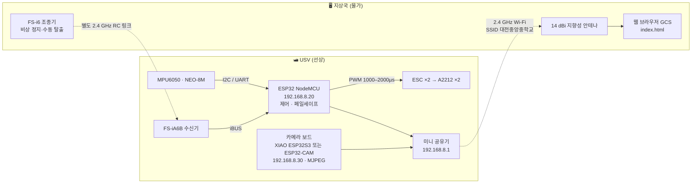
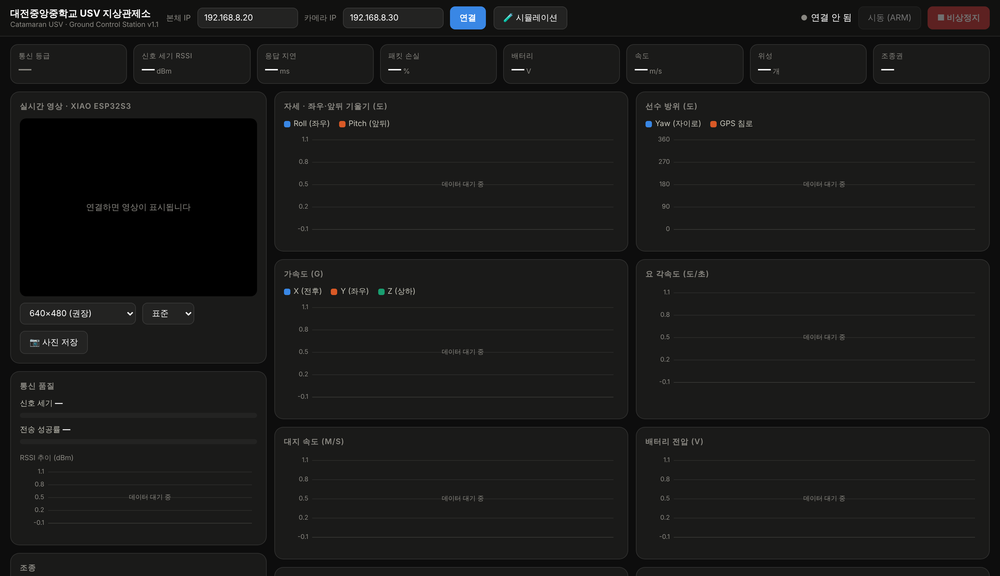
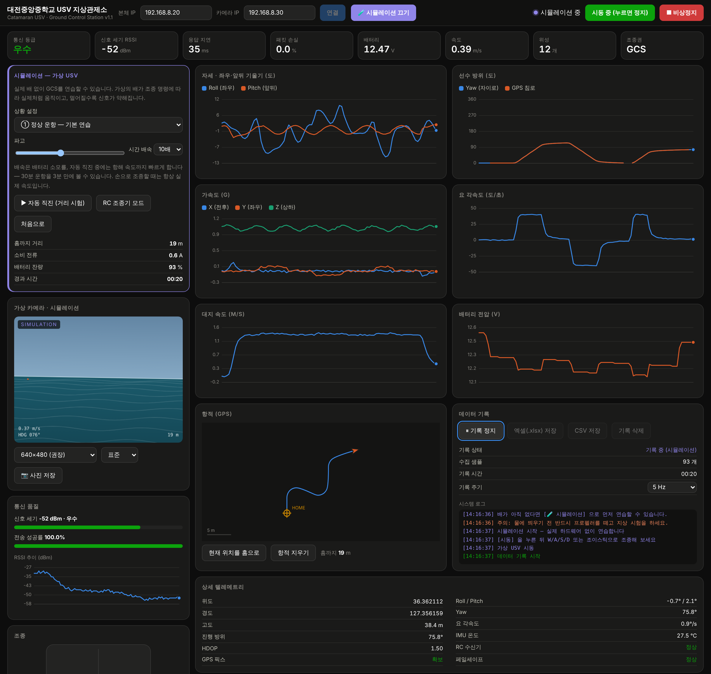

# 대전중앙중학교 3D프린팅 쌍동선 무인정 (USV)

> 에어프로펠러 차동추진 · ESP32 텔레메트리 · 웹 브라우저 지상관제소 · 실시간 영상 전송
> **하드웨어가 없어도 시뮬레이션 모드로 전 과정을 연습할 수 있습니다.**


중학생이 처음부터 끝까지 만들 수 있도록 설계한 수상 무인정입니다. 선체는 3D 프린터로 출력하고,
수면 위 공기 프로펠러 두 개를 따로따로 돌려(차동추진) 전진·후진·좌회전·우회전·제자리 회전을 합니다.
배 안에 미니 공유기를 넣어 하나의 작은 섬 네트워크를 만들고, 물가의 노트북에서
브라우저만 열면 센서 그래프·실시간 영상·통신 품질을 한 화면에서 봅니다.

---

## 목차

- [무엇을 만드는가](#무엇을-만드는가)
- [완성 사양](#완성-사양)
- [시스템 구성](#시스템-구성)
- [3분 만에 시작하기 — 시뮬레이션](#3분-만에-시작하기--시뮬레이션)
- [지상관제소(GCS) 화면](#지상관제소gcs-화면)
- [시뮬레이션으로 배우는 안전 상황](#시뮬레이션으로-배우는-안전-상황)
- [저장소 구조](#저장소-구조)
- [문서](#문서)
- [예산](#예산)
- [안전 수칙](#안전-수칙)
- [라이선스](#라이선스)

---

## 무엇을 만드는가

| | |
|---|---|
| **선체** | 3D 프린팅 쌍동선(catamaran). 동체 두 개가 멀리 떨어져 있어 잘 넘어지지 않고, 가운데 데크가 넓어 장비를 얹기 쉽습니다. |
| **추진** | 수면 위 공기 프로펠러 2기. 물에 잠기는 부품이 없어 방수 걱정이 없고, 수초에 감기지 않습니다. |
| **제어** | ESP32 NodeMCU — IMU·GPS를 읽고, 두 ESC에 PWM을 내보내고, 10 Hz로 텔레메트리를 송신합니다. |
| **영상** | XIAO ESP32S3 Sense **또는** ESP32-CAM AI-Thinker — MJPEG 스트림을 따로 송출합니다. 둘 중 가진 것을 쓰면 되고, GCS는 고칠 필요가 없습니다. |
| **통신** | USV에 탑재한 미니 공유기 중심의 Wi-Fi 네트워크 + 별도 RC 조종기(안전장치) |
| **관제** | 라이브러리 0개의 단일 HTML 파일. 인터넷 없이 더블클릭으로 열립니다. |

---

## 완성 사양

| 항목 | 값 | 비고 |
|---|---|---|
| 전장 × 전폭 | 600 × 440 mm | 동체 중심 간격 350 mm |
| 완성 중량 | 약 2.4 kg | 배터리 포함 |
| 흘수 / 건현 | 약 32 mm / 88 mm | 부력 3.02 kgf |
| 모터 | A2212 10T **1400KV** × 2 | 에어프로펠러 전용 |
| 프로펠러 | 8045 (8 × 4.5″) CW + CCW | 좌우에 하나씩 |
| ESC | 30 A BLHeli_S **3D(양방향) 모드** | 후진 필수 조건 |
| 최대 추력 | 1,560 gf | 추력/중량비 0.62 |
| 최고 속도 | 약 2.2 m/s | 100 % 출력 기준 |
| 배터리 | 3S 5000 mAh 30C | 11.1 V |
| 운용 시간 | **약 30분** | 순항 55 %, 실운용 보정 반영 |
| 통달 거리 | **0.8 ~ 1.2 km** | 지상국 14 dBi 지향성 안테나 기준 |
| 카메라 | XIAO ESP32S3 Sense 또는 ESP32-CAM | 둘 다 지원. 펌웨어만 골라 올립니다 |
| 텔레메트리 | 10 Hz · 31개 항목 | WebSocket JSON |

A2212 1400KV가 왜 **에어프로펠러에는 적합하고 수중 직결에는 부적합한지**,
그 근거 계산은 [docs/01-HARDWARE.md](docs/01-HARDWARE.md#1-a2212-10t-1400kv-적합성-검증)에 있습니다.

---

## 시스템 구성



**두 개의 독립된 무선 링크**가 이 설계의 핵심입니다. Wi-Fi가 끊겨도 RC 조종기는 살아 있고,
RC까지 끊기면 펌웨어가 1.5초 뒤 모터를 스스로 세웁니다. 어느 한쪽도 혼자서는 배를 책임지지 않습니다.

### 고정 IP 배정

| 장치 | IP | 역할 | 포트 |
|---|---|---|---|
| 미니 공유기 | `192.168.8.1` | Wi-Fi AP · 관리 페이지 | 80 |
| ESP32 NodeMCU | `192.168.8.20` | 제어 · 센서 · 텔레메트리 | 80 (`/ws`) |
| 카메라 보드 | `192.168.8.30` | MJPEG 영상 스트림 | 80 (`/stream`) |
| 노트북 (GCS) | `192.168.8.100~` | DHCP 자동 할당 | — |

---

## 3분 만에 시작하기 — 시뮬레이션

**부품이 하나도 없어도 지금 바로 해볼 수 있습니다.**

```bash
git clone https://github.com/<your-id>/daejeon-usv.git
cd daejeon-usv
```

`gcs/index.html` 을 크롬으로 더블클릭해 엽니다. 설치할 것도, 인터넷도 필요 없습니다.

<p align="center">
  
</p>

1. 헤더의 **🧪 시뮬레이션** 을 누릅니다
2. **시동 (ARM)** 을 누릅니다
3. <kbd>W</kbd> <kbd>A</kbd> <kbd>S</kbd> <kbd>D</kbd> 로 배를 몰아 봅니다

가상의 배가 **실제 물리 모델**로 움직이기 시작합니다. 2.4 kg 쌍동선, 모터 2기 차동추진,
2차 항력식 — W를 누르면 천천히 가속해 1.3 m/s쯤에서 안정되고, D를 누르면 한쪽 모터가
역회전하며 제자리에서 돕니다. 돌 때는 원심력으로 배가 바깥쪽으로 기웁니다.

<p align="center">
  
  <br><em>시뮬레이션 모드로 운항 중인 GCS. 모든 숫자와 그래프가 가상 USV에서 실시간으로 올라옵니다.</em>
</p>

> 시뮬레이션의 물리·통신 모델이 어떻게 만들어졌는지는 [docs/05-SIMULATION.md](docs/05-SIMULATION.md)에 자세히 적어 두었습니다.

---

## 지상관제소(GCS) 화면

### 상태 타일 — 한눈에 보는 8가지


통신 등급 · 신호 세기 · 응답 지연 · 패킷 손실 · 배터리 · 속도 · 위성 수 · 조종권.
멀리 있는 배에서 지금 당장 알아야 할 것만 큰 글씨로 올려 두었습니다.

### 센서 그래프 6종


자세(Roll/Pitch) · 선수 방위 · 가속도 XYZ · 요 각속도 · 대지 속도 · 배터리 전압.
단위가 다른 값을 한 그래프에 겹치지 않도록 전부 따로 떼어 놓았고, 마우스를 올리면
그 시점의 모든 값이 툴팁으로 나옵니다. 라이브러리 없이 캔버스로 직접 그렸습니다.

### 통신 품질


RSSI·패킷 손실·왕복 지연을 종합해 **우수 / 양호 / 주의 / 약함 / 불량** 다섯 등급으로 판정합니다.
"주의"가 뜨는 거리가 그날의 운용 한계입니다.

### 가상 카메라 / 실시간 영상


실제 운용에서는 카메라 보드(XIAO ESP32S3 또는 ESP32-CAM)의 MJPEG 스트림이 들어옵니다.
시뮬레이션에서는 수평선이 롤·피치에 따라 기울고, 파도가 속도에 맞춰 흐르고,
부표 6개가 배의 위치·방위에 따라 지나가는 가상 화면이 대신 들어옵니다.

### 조종


키보드 · 화면 조이스틱 · 게임패드 세 가지를 모두 지원합니다.
**출력 제한 슬라이더**는 처음에 40 %에서 시작하는 것을 권합니다.

### 항적


지도 타일을 받아오지 않고 GPS 좌표만으로 궤적을 직접 그립니다.
인터넷이 없는 물가에서도 동작하며, 홈 위치와 홈까지의 거리를 항상 표시합니다.

### 데이터 기록 → 엑셀


`기록 시작` → `엑셀(.xlsx) 저장`. 두 장의 시트가 든 진짜 엑셀 파일이 브라우저 안에서 바로 만들어집니다.

- **텔레메트리** 시트 — 31개 항목의 전체 원본 (+ 실측/시뮬레이션 구분 열)
- **요약** 시트 — 항목별 최소·최대·평균

ZIP 컨테이너와 OOXML을 순수 자바스크립트로 직접 조립하기 때문에 인터넷도 라이브러리도 필요 없습니다.

---

## 시뮬레이션으로 배우는 안전 상황

실제 배로는 **일부러 만들 수 없는 위험 상황**을 교실에서 보여줄 수 있습니다.
시뮬레이션 패널의 `상황 설정`에서 고르기만 하면 됩니다.


### ② 통신 약화 — 어디까지 나가도 되는가


신호가 15 dB 깎인 상태로 멀어지면 RSSI가 떨어지고, 그만큼 **패킷이 실제로 버려집니다**.
위 화면은 131 m 지점에서 −84 dBm / 손실 18 % / 등급 **약함** — 즉시 회항해야 하는 상태입니다.


### ⑤ 전복 — 페일세이프는 정말 동작하는가


12초 뒤부터 배가 서서히 기울고, **롤 70°를 넘는 순간 펌웨어가 스스로 시동을 끕니다.**
자세 그래프가 치솟고, 가상 카메라의 수평선이 넘어가고, 시동 버튼이 저절로 풀리는 것을
학생들이 눈으로 확인할 수 있습니다.


페일세이프 사유(`CAPSIZED`)는 5초간 화면에 남습니다. 멀리서 조종하던 학생이
"왜 멈췄는지"를 놓치지 않도록 일부러 붙잡아 두는 장치입니다.

### ⑥ 통신 두절 — 끊긴 걸 어떻게 아는가


텔레메트리가 2초 이상 끊기면 연결 표시가 **신호 없음**으로 바뀌고 상태 타일이 흐려집니다.
마지막 값이 그대로 남아 "아직 살아 있는 것처럼" 보이는 상황을 막기 위한 감시견입니다.

### ④ 파고 높음 — 자세 센서는 무엇을 보는가


파고를 올리면 Roll·Pitch가 주기적으로 흔들립니다. 여기에 선회 시 원심력에 의한
횡경사가 겹쳐서, 왜 모터 진동 대책과 상보 필터가 필요한지 설명하기 좋습니다.

| 번호 | 상황 | 무엇을 확인하나 |
|---|---|---|
| ① | 정상 운항 | 기본 조종 감각, 차동추진 원리 |
| ② | 통신 약화 | 등급 경보, 운용 한계 거리 판단 |
| ③ | 저전압 출발 | 배터리 경보, 10.2 V 자동 정지 |
| ④ | 파고 높음 | 자세 그래프 읽기 |
| ⑤ | 전복 | 롤 70° 페일세이프 |
| ⑥ | 통신 두절 | 신호 끊김 감지 |

---

## 저장소 구조

```
daejeon-usv/
├── README.md                       이 문서
├── LICENSE
├── firmware/
│   ├── usv_main_esp32/             ESP32 NodeMCU — 제어·센서·텔레메트리
│   │   └── usv_main_esp32.ino
│   ├── usv_cam_xiao/               [카메라 A] XIAO ESP32S3 Sense
│   │   └── usv_cam_xiao.ino
│   └── usv_cam_esp32cam/           [카메라 B] ESP32-CAM AI-Thinker
│       └── usv_cam_esp32cam.ino
├── gcs/
│   └── index.html                  지상관제소 (단일 파일, 의존성 0)
├── hardware/
│   ├── build_bom.py                BOM 워크북 생성 스크립트
│   └── 대전중앙중_USV_BOM.xlsx       부품표 · 예산 · 추진성능 계산기
└── docs/
    ├── 01-HARDWARE.md              모터 검증 · BOM · 배선 · ESC 설정
    ├── 02-BUILD.md                 3D 프린팅 · 조립 · 시험 절차
    ├── 03-NETWORK.md               공유기 설정 · 장거리 통신
    ├── 04-GCS.md                   GCS 사용 설명서
    ├── 05-SIMULATION.md            시뮬레이션 물리·통신 모델
    ├── 06-TROUBLESHOOTING.md       고장 진단
    └── images/                     시뮬레이션 화면 캡처
```

---

## 문서

| 문서 | 내용 |
|---|---|
| [01-HARDWARE.md](docs/01-HARDWARE.md) | **A2212 1400KV 적합성 검증**, 프로펠러 선정, 전체 BOM, 핀 배치, 전원 계통, ESC 3D 모드 설정 |
| [02-BUILD.md](docs/02-BUILD.md) | 선체 치수와 부력 계산, 3D 프린팅 설정, 방수 마감, 조립 순서 12단계, **5단계 시험 절차** |
| [03-NETWORK.md](docs/03-NETWORK.md) | 공유기 설정(SSID `대전중앙중학교`), 장거리 통신 단계별 확보, LoRa 백업, 전파 규정 |
| [04-GCS.md](docs/04-GCS.md) | 화면 구성, 조종 방법, 통신 등급 읽는 법, 엑셀 저장, 텔레메트리 프로토콜 |
| [05-SIMULATION.md](docs/05-SIMULATION.md) | 물리 모델 수식, 통신 모델, 6가지 상황, **수업 활용 시나리오** |
| [06-TROUBLESHOOTING.md](docs/06-TROUBLESHOOTING.md) | 증상별 원인과 해결 |

---

## 예산

| 구분 | 금액 | 비율 |
|---|---:|---:|
| A. 추진계 | 90,800원 | 9.2 % |
| B. 제어·센서 | 86,300원 | 8.7 % |
| C. 전원 | 195,000원 | 19.8 % |
| D. 통신 | 246,000원 | 24.9 % |
| E. RC 조종 | 90,000원 | 9.1 % |
| F. 선체·기구 | 192,200원 | 19.5 % |
| G. 공구·소모품 | 87,000원 | 8.8 % |
| **합계** | **987,300원** | |

공구(G)와 충전기를 학교에서 이미 보유 중이라면 약 90만원, **2호기부터는 공구·송신기·지상국 안테나가
재사용되어 55만원 선**으로 줄어듭니다. 단가는 2026년 국내 온라인 유통 기준 참고가이며,
`hardware/대전중앙중_USV_BOM.xlsx` 에서 직접 수정할 수 있습니다.

---

## 안전 수칙

> [!WARNING]
> **프로펠러는 15,540 rpm으로 돕니다.**
> - 프로펠러 가드 없이는 절대 전원을 넣지 마세요
> - 펌웨어 업로드·지상 시험 때는 **프로펠러를 빼 두는 것이 기본**입니다
> - 배터리를 꽂기 전 "프로펠러 주변 비었나?"를 소리 내어 확인하세요

> [!CAUTION]
> **리튬폴리머 배터리**는 사람이 지켜보는 상태에서, 방염 가방 안에서만 충전합니다.
> 부풀거나 찌그러진 배터리는 되살리려 하지 말고 즉시 폐기하세요.

> [!IMPORTANT]
> 물가에서는 **구명조끼를 착용**하고, 지도교사 없이 진행하지 않습니다.
> 회수 계획(긴 로프·뜰채·필요하면 보트)을 먼저 세우고, **돌아올 몫의 배터리를 남겨 두고 회항**합니다.

운항 전 최종 점검 5가지 — ① 프로펠러 가드 고정 ② 배터리 12 V 이상 ③ RC 조종기 켜짐·비상정지 확인
④ GCS 통신 등급 "양호" 이상 ⑤ 인클로저 뚜껑 닫힘·케이블 그랜드 조임

---

## 라이선스

[MIT License](LICENSE) — 교육 목적으로 자유롭게 복제·수정·배포하실 수 있습니다.
개선한 내용은 Pull Request로 돌려주시면 다른 학교 학생들에게도 도움이 됩니다.

부품 단가, 통달 거리, 추력·전류 수치는 참고값입니다. 실제 제작 시 반드시 직접 측정하고,
전파 관련 규정은 운용하는 지역의 법령을 따르세요.
