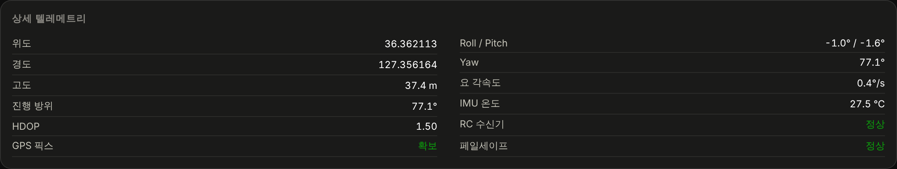
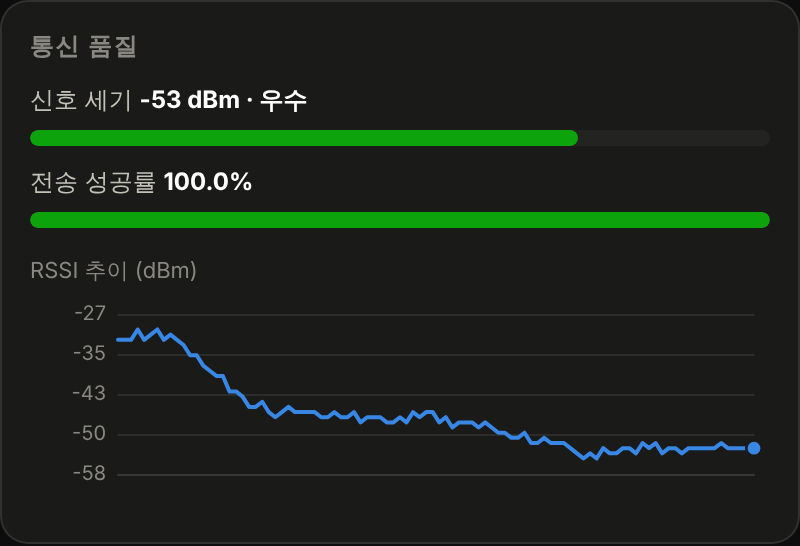
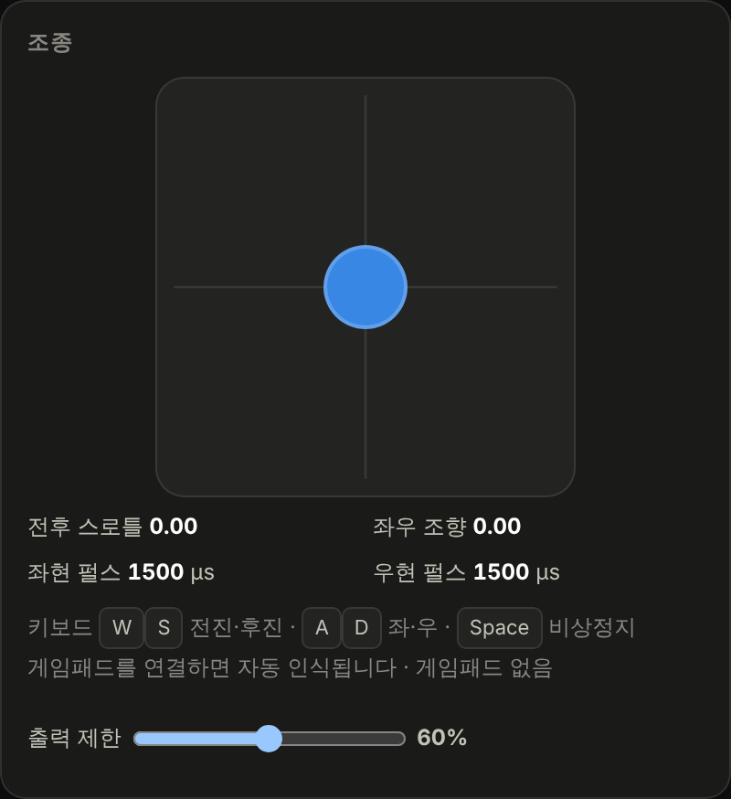
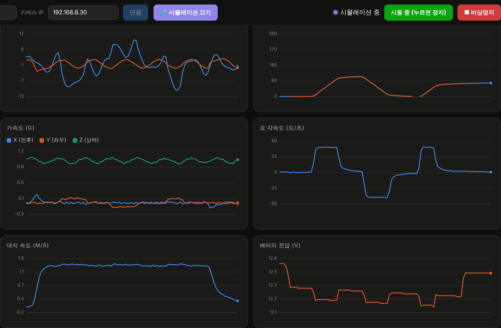
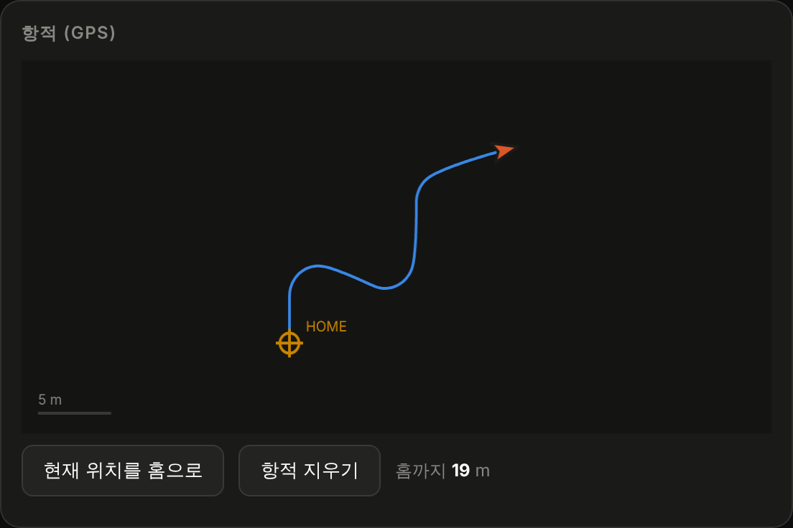
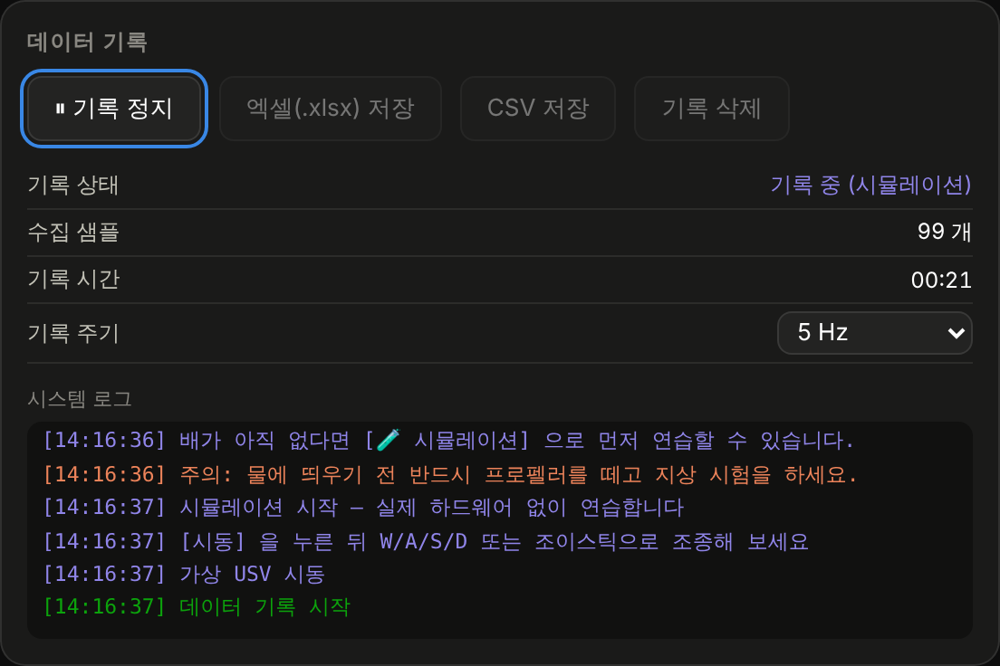

# 04 · 지상관제소 (GCS)

[← 저장소 홈으로](../README.md)

`gcs/index.html` 파일 **하나**가 지상관제소 전부입니다. 외부 라이브러리를 하나도 쓰지 않아
인터넷 없는 물가에서도 더블클릭 한 번으로 열립니다.

- [1. 열기와 접속](#1-열기와-접속)
- [2. 화면 구성](#2-화면-구성)
- [3. 상태 타일 8종](#3-상태-타일-8종)
- [4. 통신 등급 읽는 법](#4-통신-등급-읽는-법)
- [5. 조종](#5-조종)
- [6. 센서 그래프](#6-센서-그래프)
- [7. 항적](#7-항적)
- [8. 데이터 기록과 엑셀 저장](#8-데이터-기록과-엑셀-저장)
- [9. 영상](#9-영상)
- [10. 통신 규약 (프로토콜)](#10-통신-규약-프로토콜)
- [11. 브라우저 요구사항](#11-브라우저-요구사항)

---

## 1. 열기와 접속

### 준비물

노트북 한 대. 그게 전부입니다. 설치할 프로그램도, 인터넷 연결도 필요 없습니다.

### 실제 USV에 접속하기

1. 노트북을 Wi-Fi **`대전중앙중학교`** 에 접속합니다 (비밀번호 `2026USV`)
2. `gcs/index.html` 을 크롬으로 엽니다
3. 헤더의 **본체 IP** 가 `192.168.8.20`, **카메라 IP** 가 `192.168.8.30` 인지 확인합니다
4. **연결** 을 누릅니다

연결되면 왼쪽 위 점이 초록색으로 바뀌고 "연결됨"이 뜹니다.

> [!TIP]
> 연결이 안 되면 브라우저 주소창에 `http://192.168.8.20/health` 를 쳐 보세요.
> `{"ok":1,...}` 가 나오면 본체는 살아 있는 것이고, GCS 설정 문제입니다.
> 아무것도 안 나오면 본체가 공유기에 못 붙은 것입니다.

### 배가 없을 때 — 시뮬레이션

**🧪 시뮬레이션** 버튼을 누르면 가상의 USV가 생겨 모든 기능을 그대로 연습할 수 있습니다.
자세한 내용은 [05-SIMULATION.md](05-SIMULATION.md) 에 있습니다.

---

## 2. 화면 구성

화면은 세로로 세 덩어리입니다.

| 위치 | 담는 것 |
|---|---|
| **상단** | 접속 설정 · 연결 상태 · 시동(ARM) · 비상정지 · 상태 타일 8개 |
| **왼쪽 열** | (시뮬레이션 패널) · 영상 · 통신 품질 · 조종 |
| **오른쪽 열** | 센서 그래프 6종 · 항적 · 데이터 기록 · 상세 텔레메트리 |

조종에 필요한 것은 왼쪽에, 읽고 판단할 것은 오른쪽에 모았습니다.
배를 몰면서 눈이 왔다 갔다 하지 않도록 한 배치입니다.

---

## 3. 상태 타일 8종


| 타일 | 의미 | 주의해야 할 값 |
|---|---|---|
| **통신 등급** | RSSI·손실·지연을 종합한 다섯 등급 | `주의` 부터는 더 멀리 가지 않습니다 |
| **신호 세기 RSSI** | 본체가 보고한 수신 신호 세기 | `−78 dBm` 아래로 떨어지면 위험 |
| **응답 지연** | GCS→본체→GCS 왕복 시간 | `400 ms` 초과 시 조종이 밀립니다 |
| **패킷 손실** | 최근 100개 중 못 받은 비율 | `12 %` 초과 시 회항 |
| **배터리** | 3S 팩 전압 | `10.8 V` 경고 · `10.2 V` 자동 정지 |
| **속도** | GPS 대지 속도 | — |
| **위성** | 수신 중인 위성 수 | `4개` 미만이면 위치 신뢰 불가 |
| **조종권** | 지금 누가 모는가 | `RC 조종기` / `GCS` |

### 상세 텔레메트리

화면 맨 아래에는 타일에 없는 나머지 항목이 모여 있습니다.



`페일세이프` 칸이 **정상**이 아닌 값(`GCS_LINK_LOST`, `BATTERY_CRITICAL`, `CAPSIZED`)을
보이면 본체가 스스로 모터를 세운 것입니다. 이 사유는 5초간 화면에 남습니다.

---

## 4. 통신 등급 읽는 법



GCS는 세 가지를 동시에 봅니다.

- **RSSI** — 본체가 매 패킷에 실어 보내는 값
- **패킷 손실** — 텔레메트리의 `seq` 번호가 건너뛴 만큼을 세어 GCS가 직접 계산
- **왕복 지연** — GCS가 0.5초마다 보내는 `ping` 에 대한 응답 시간

세 값이 **모두** 조건을 만족해야 그 등급입니다.

| 등급 | RSSI | 손실 | 지연 | 대응 |
|---|---|---|---|---|
| 🟢 **우수** | > −60 dBm | < 2 % | < 80 ms | 자유롭게 운항 |
| 🟢 **양호** | > −70 dBm | < 5 % | < 180 ms | 정상 운용 구간 |
| 🟡 **주의** | > −78 dBm | < 12 % | < 400 ms | **더 멀리 가지 말 것** |
| 🟠 **약함** | > −85 dBm | < 30 % | — | 즉시 회항 |
| 🔴 **불량** | 그 밖 | | | 회수 준비 |

> [!IMPORTANT]
> **"주의"가 처음 뜨는 거리가 그날의 운용 한계입니다.** 날씨·수면 상태·주변 전파 혼잡도에 따라
> 매일 달라지므로, 시험 운항 때마다 새로 확인하고 그 거리를 넘지 마세요.

### 신호 없음

텔레메트리가 **2초 이상** 끊기면 연결 표시가 `신호 없음` 으로 바뀌고 상태 타일이 흐려집니다.
마지막으로 받은 값이 그대로 남아 "아직 살아 있는 것처럼" 보이는 상황을 막기 위한 감시견입니다.

---

## 5. 조종



### 세 가지 입력 방법

| 방법 | 조작 |
|---|---|
| **키보드** | <kbd>W</kbd> 전진 · <kbd>S</kbd> 후진 · <kbd>A</kbd> 좌 · <kbd>D</kbd> 우 · <kbd>Space</kbd> 비상정지 (화살표 키도 동일) |
| **화면 조이스틱** | 마우스나 터치로 드래그. 손을 떼면 자동으로 중립 |
| **게임패드** | USB로 꽂으면 자동 인식. 왼쪽 스틱 전후 · 오른쪽 스틱 좌우 · B 버튼 비상정지 |

세 입력은 동시에 살아 있고, 게임패드 → 조이스틱 → 키보드 순으로 우선합니다.

### 출력 제한 슬라이더

모든 조종 입력에 곱해지는 배율입니다.

> [!TIP]
> **처음에는 40 %에서 시작하세요.** 100 %는 생각보다 훨씬 빠르고,
> 초보자가 좁은 수역에서 쓰면 거의 반드시 어딘가에 부딪힙니다.

### 시동(ARM)과 비상정지

- **시동 (ARM)** — 누르기 전까지 모터는 어떤 명령에도 반응하지 않습니다
- **■ 비상정지** — 시동을 끄고 모터를 중립으로. <kbd>Space</kbd> 와 같습니다

RC 조종기가 연결되어 있을 때는 **RC의 아밍 스위치(CH6)가 올라가 있어야** GCS에서 시동을 걸 수 있습니다.
물가에 선 사람이 최종 거부권을 갖는 구조입니다.

### 조종권

RC 조종기의 CH5 스위치를 올리면 조종권이 RC로 넘어가고, 상태 타일의 `조종권` 이
**RC 조종기** 로 바뀝니다. GCS 명령은 그동안 무시됩니다.

---

## 6. 센서 그래프



| 그래프 | 계열 | 읽는 법 |
|---|---|---|
| **자세** | Roll(좌우) · Pitch(앞뒤) | 파도에 따라 주기적으로 흔들립니다. 선회 중에는 원심력으로 바깥쪽으로 기웁니다 |
| **선수 방위** | Yaw(자이로) · GPS 침로 | 두 선이 겹쳐 가면 자이로가 잘 보정되고 있는 것입니다 |
| **가속도** | X(전후) · Y(좌우) · Z(상하) | Z는 평소 1 g 부근. 파도에 따라 오르내립니다 |
| **요 각속도** | — | 회전이 얼마나 빠른지. 제자리 회전에서 가장 큽니다 |
| **대지 속도** | — | GPS 기준 실제 속도 |
| **배터리 전압** | — | 스로틀을 올리면 내려가고 놓으면 회복됩니다 |

단위가 다른 값을 한 그래프에 겹치면 작은 값이 눌려 보이지 않으므로, 모두 따로 떼어 놓았습니다.
마우스를 올리면 그 시점의 모든 계열 값이 툴팁으로 나옵니다.

> 선수 방위 그래프는 359° → 1° 로 넘어갈 때 선을 **일부러 끊습니다.**
> 그러지 않으면 화면을 세로로 가로지르는 가짜 선이 생깁니다.

---

## 7. 항적



지도 타일을 인터넷에서 받아오지 않고, **GPS 좌표만으로 궤적을 직접 그립니다.**
전파가 안 터지는 저수지에서도 그대로 동작합니다.

- 🟠 십자 표식 — 홈 위치 (첫 GPS 픽스 지점, `현재 위치를 홈으로` 로 변경 가능)
- 🔺 삼각형 — 현재 위치와 선수 방향
- 왼쪽 아래 — 자동 축척 막대
- 오른쪽 — 홈까지의 직선 거리 (m)

---

## 8. 데이터 기록과 엑셀 저장



### 사용법

1. **기록 시작** — 텔레메트리가 쌓이기 시작합니다
2. **기록 주기** 선택 — `10 Hz(전부)` / `5 Hz` / `1 Hz`
3. **엑셀(.xlsx) 저장** 또는 **CSV 저장**

30분 운항을 5 Hz로 기록하면 약 9,000행이 됩니다.

### 엑셀 파일 구성

| 시트 | 내용 |
|---|---|
| **텔레메트리** | 아래 32개 열의 전체 원본 |
| **요약** | Roll·Pitch·속도·전압·RSSI·지연·손실·위성 수의 최소/최대/평균 |

기록한 데이터가 시뮬레이션이면 요약 시트의 `데이터 종류` 가 **시뮬레이션 (연습용)** 으로,
각 행의 `구분` 열이 **시뮬레이션** 으로 표시됩니다. 실측 데이터와 섞이지 않습니다.

<details>
<summary><b>기록 열 32개 전체 보기</b></summary>

| # | 열 이름 | 설명 |
|---|---|---|
| 1 | 시각 | 기록 시점 (`HH:MM:SS`) |
| 2 | 경과(s) | 기록 시작부터의 초 |
| 3 | seq | 패킷 일련번호 (손실 추적용) |
| 4–6 | Roll / Pitch / Yaw (deg) | 자세 |
| 7–9 | AccX / AccY / AccZ (g) | 가속도 |
| 10 | GyroZ (deg/s) | 요 각속도 |
| 11 | IMU온도 (C) | MPU6050 내부 온도 |
| 12–13 | 위도 / 경도 | GPS 좌표 |
| 14 | 고도 (m) | GPS 고도 |
| 15 | 속도 (m/s) | 대지 속도 |
| 16 | 방위 (deg) | GPS 침로 |
| 17 | 위성수 | — |
| 18 | HDOP | 수평 정밀도 (작을수록 좋음) |
| 19 | GPS픽스 | 1 = 확보 |
| 20 | 전압 (V) | 배터리 |
| 21 | RSSI (dBm) | 신호 세기 |
| 22 | 지연 (ms) | 왕복 지연 |
| 23 | 손실 (%) | 패킷 손실률 |
| 24–25 | 스로틀 / 조향 | 실제 적용된 명령 (−1 ~ 1) |
| 26–27 | 좌ESC / 우ESC (us) | ESC 펄스 폭 |
| 28 | 시동 | 1 = ARM |
| 29 | 모드 | `GCS` / `RC` |
| 30 | RC상태 | 1 = 수신기 정상 |
| 31 | 페일세이프 | 사유 문자열 |
| 32 | 구분 | `실측` / `시뮬레이션` |

</details>

### 라이브러리 없이 어떻게 엑셀을 만드나

`.xlsx` 는 사실 **XML 파일 몇 개를 담은 ZIP 압축 파일**입니다. GCS는

1. 시트별 XML을 문자열로 조립하고
2. CRC32를 직접 계산한 뒤
3. **무압축(stored) ZIP** 컨테이너로 묶습니다

압축을 하지 않으므로 deflate 구현이 필요 없고, 전체가 200줄 남짓한 자바스크립트로 끝납니다.
그래서 인터넷도 라이브러리도 없이 진짜 엑셀 파일이 나옵니다.

---

## 9. 영상

카메라 보드(XIAO ESP32S3 Sense 또는 ESP32-CAM AI-Thinker)가 보내는 MJPEG 스트림을
`` 태그로 직접 받습니다. **두 보드의 주소 체계가 같아서 GCS는 어느 쪽인지 구분하지 않습니다.**

| 설정 | 선택지 | 쓰임 |
|---|---|---|
| 해상도 | `320×240` / `640×480` / `800×600` | 멀어지면 낮출 것 |
| 화질 | `저용량` / `표준` / `고화질` | — |
| 📷 사진 저장 | — | 현재 프레임을 JPG로 |

**ESP32-CAM을 쓴다면** 플래시 LED를 원격으로 켤 수 있습니다. 해질 무렵 배를 찾을 때 쓰세요.
브라우저 주소창에 `http://192.168.8.30/control?led=255` (최대) / `?led=60` (약하게) / `?led=0` (끄기).

> [!WARNING]
> **영상이 조종을 밀어냅니다.** 거리가 멀어져 대역폭이 모자라면 영상이 링크를 다 먹고
> 조종 명령과 텔레메트리가 늦게 도착합니다. 멀리 나갈 때는 해상도를 `320×240` 으로 낮추세요.
> **화질보다 조종이 우선입니다.**

---

## 10. 통신 규약 (프로토콜)

GCS와 본체는 `ws://192.168.8.20/ws` 위에서 JSON 한 줄씩을 주고받습니다.
직접 다른 프로그램을 만들어 붙이고 싶다면 이 규약만 맞추면 됩니다.

### 본체 → GCS : 텔레메트리 (10 Hz)

```json
{
  "seq": 1234, "t": 125300,
  "roll": -1.4, "pitch": 1.9, "yaw": 76.4,
  "ax": 0.03, "ay": -0.02, "az": 1.01, "gz": -0.6, "tmp": 28.5,
  "lat": 36.362081, "lon": 127.356870, "alt": 38.0,
  "spd": 1.33, "cog": 76.4, "sat": 12, "hdop": 1.05, "fix": 1,
  "vbat": 12.08, "rssi": -65,
  "arm": 1, "mode": "GCS", "rc": 1,
  "thr": 0.45, "str": 0.00, "pl": 1711, "pr": 1711,
  "fs": ""
}
```

| 키 | 뜻 | 키 | 뜻 |
|---|---|---|---|
| `seq` | 패킷 번호 | `fix` | GPS 픽스 (0/1) |
| `t` | 본체 가동 시간 (ms) | `vbat` | 배터리 전압 (V) |
| `roll` `pitch` `yaw` | 자세 (도) | `rssi` | 신호 세기 (dBm) |
| `ax` `ay` `az` | 가속도 (g) | `arm` | 시동 상태 (0/1) |
| `gz` | 요 각속도 (도/초) | `mode` | `"GCS"` / `"RC"` |
| `tmp` | IMU 온도 (℃) | `rc` | RC 수신기 정상 (0/1) |
| `lat` `lon` `alt` | 위치 | `thr` `str` | 적용된 명령 (−1~1) |
| `spd` `cog` | 속도·침로 | `pl` `pr` | 좌·우 ESC 펄스 (µs) |
| `sat` `hdop` | 위성 수·정밀도 | `fs` | 페일세이프 사유 |

### GCS → 본체 : 명령

| 명령 | 형식 | 주기 |
|---|---|---|
| 조종 | `{"c":"drive","thr":0.45,"str":-0.1}` | 20 Hz |
| 시동 | `{"c":"arm","v":1}` | 버튼 |
| 비상정지 | `{"c":"stop"}` | 버튼 |
| 지연 측정 | `{"c":"ping","id":17}` → `{"c":"pong","id":17}` | 2 Hz |
| 부저 | `{"c":"beep"}` | 버튼 |

> `drive` 명령이 **1.5초간 끊기면** 본체가 스스로 모터를 중립으로 되돌립니다.
> 그래서 GCS는 조종을 안 할 때도 `thr:0, str:0` 을 계속 보냅니다. 이 신호가 끊긴 것 자체가
> 통신 두절의 증거가 됩니다.

---

## 11. 브라우저 요구사항

| 항목 | 내용 |
|---|---|
| 권장 브라우저 | 크롬 / 엣지 (최신) |
| 필요 기능 | WebSocket · Canvas · Gamepad API |
| 인터넷 | **불필요** |
| 설치 | **불필요** |

> [!NOTE]
> 파일을 교체한 뒤에는 <kbd>Ctrl</kbd>+<kbd>Shift</kbd>+<kbd>R</kbd> 로 강력 새로고침 하세요.
> 브라우저가 이전 파일을 캐시에 들고 있을 수 있습니다.

---

[→ 다음: 05-SIMULATION.md (시뮬레이션)](05-SIMULATION.md)
