# 05 · 시뮬레이션

[← 저장소 홈으로](../README.md)

**하드웨어가 하나도 없어도 GCS 전 과정을 연습할 수 있습니다.**
가짜 숫자를 뿌리는 게 아니라, 실제 물리 모델을 돌려 그 결과를 펌웨어와 똑같은 형식으로 올려보냅니다.

- [1. 왜 시뮬레이션인가](#1-왜-시뮬레이션인가)
- [2. 켜고 끄기](#2-켜고-끄기)
- [3. 물리 모델](#3-물리-모델)
- [4. 통신 모델](#4-통신-모델)
- [5. 전력 모델](#5-전력-모델)
- [6. 여섯 가지 상황](#6-여섯-가지-상황)
- [7. 가상 카메라](#7-가상-카메라)
- [8. 수업에 쓰기](#8-수업에-쓰기)
- [9. 시뮬레이션이 흉내 내지 못하는 것](#9-시뮬레이션이-흉내-내지-못하는-것)

---

## 1. 왜 시뮬레이션인가

부품을 주문하고, 선체를 출력하고, 납땜을 마치기까지 몇 주가 걸립니다.
그동안 학생들은 아무것도 할 수 없습니다. 더 큰 문제는 따로 있습니다 —

> **배가 완성된 날, 학생들은 GCS를 처음 봅니다.**
> 그리고 그 첫 조작이 물 위에서 이루어집니다.

시뮬레이션은 이 순서를 뒤집습니다. 부품이 오기 전에 조종 감각을 익히고, 그래프를 읽는 법을 배우고,
통신이 끊기면 어떻게 되는지 **교실에서 미리 겪어 봅니다.**

그리고 하나 더 — 전복이나 저전압 같은 위험 상황은 실제 배로 **일부러 만들 수 없습니다.**
시뮬레이션에서는 메뉴에서 고르기만 하면 됩니다.

---

## 2. 켜고 끄기

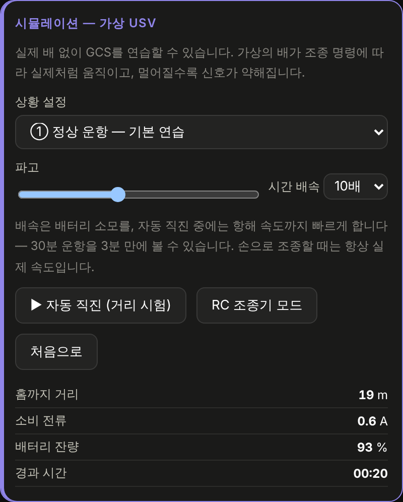

헤더의 **🧪 시뮬레이션** 을 누르면 왼쪽에 보라색 패널이 생기고, 영상 자리에 가상 카메라가 들어옵니다.
연결 표시는 `시뮬레이션 중` 으로 바뀝니다.

| 조작 | 하는 일 |
|---|---|
| **상황 설정** | 여섯 가지 상황 중 선택 ([6장](#6-여섯-가지-상황)) |
| **파고** | 파도의 세기. 자세 그래프의 흔들림이 달라집니다 |
| **시간 배속** | 배터리 소모 속도. `자동 직진` 중에는 항해 속도까지 빨라집니다 |
| **▶ 자동 직진** | 스스로 직진하며 멀어집니다. 거리에 따른 신호 변화를 보는 용도 |
| **RC 조종기 모드** | 조종권을 RC로 넘깁니다. 상태 타일의 `조종권` 이 바뀝니다 |
| **처음으로** | 위치·배터리·그래프를 모두 초기 상태로 |

패널 아래쪽에는 홈까지 거리 · 소비 전류 · 배터리 잔량 · 경과 시간이 실시간으로 표시됩니다.

> [!NOTE]
> 시뮬레이션 중에는 실제 연결 버튼이 비활성화됩니다. 진짜 배와 가상 배가 섞이는 사고를 막기 위한 것입니다.

---

## 3. 물리 모델

### 기본 가정

| 기호 | 값 | 뜻 |
|---|---|---|
| $m$ | 2.4 kg | 완성 중량 |
| $I_z$ | 0.15 kg·m² | 요(yaw) 관성 모멘트 |
| $b/2$ | 0.175 m | 선체 중심에서 모터까지 (전폭 350 mm의 절반) |
| $F_{max}$ | 7.65 N | 모터 1기 최대 추력 (780 gf) |
| $k_u$ | 3.16 N·s²/m² | 전후 항력 계수 |
| $k_r$ | 1.86 N·m·s² | 회전 항력 계수 |

### 믹싱 — 펌웨어와 같은 코드

GCS가 보낸 스로틀 $T$ 와 조향 $S$ 를 좌·우 모터 명령으로 나눕니다.

$$L = T + 0.65\,S \qquad R = T - 0.65\,S$$

$|L|$ 또는 $|R|$ 이 1을 넘으면 둘을 같은 비율로 줄여 좌우 균형을 지키고, 마지막에 ±0.85로 제한합니다
(모터 보호). ESC 펄스는 $1500 + 470v\ \mu s$ 입니다.

> 이 믹싱·슬루레이트·페일세이프 판정은 **`usv_main_esp32.ino` 의 코드를 그대로 옮긴 것**입니다.
> 그래서 시뮬레이션에서 보이는 ESC 펄스 값이 실제와 같습니다.

### 추력과 운동 방정식

추력은 명령의 제곱에 비례합니다 (프로펠러의 일반적 특성).

$$F = F_{max}\cdot \mathrm{sign}(v)\cdot v^2$$

전후 운동과 회전 운동은 각각 2차 항력을 받습니다.

$$\dot{u} = \frac{(F_L + F_R) - k_u\,u|u|}{m} \qquad
\dot{r} = \frac{(F_L - F_R)\cdot \tfrac{b}{2} - k_r\,r|r|}{I_z}$$

$$\dot{\psi} = r \qquad \dot{x} = u\sin\psi \qquad \dot{y} = u\cos\psi$$

양쪽 100 % 출력에서 종단 속도는

$$u_{max} = \sqrt{\frac{2F_{max}}{k_u}} = \sqrt{\frac{15.3}{3.16}} = 2.20\ \text{m/s}$$

로, [완성 사양](../README.md#완성-사양)의 최고 속도와 같습니다.

### 자세

롤·피치는 **파도에 의한 주기 성분**과 **선회 시 원심력에 의한 횡경사**의 합입니다.

$$\phi = A\sin(2.3t) + 0.45A\sin(3.9t + 1.1) - 7\,u\,r$$

마지막 항이 횡경사입니다. 빠르게 돌수록 바깥쪽으로 더 기웁니다 — 실제 배에서 그러하듯이.

통합은 50 Hz, 텔레메트리 송신은 10 Hz로, 실제 펌웨어와 같은 주기입니다.

---

## 4. 통신 모델

### 거리에 따른 신호 세기

$$\mathrm{RSSI} = -32 - 17\log_{10}d - P_{상황} - \frac{|\phi|}{8} + \text{리플}$$

| 항 | 뜻 |
|---|---|
| $-17\log_{10}d$ | 거리에 따른 감쇠 |
| $P_{상황}$ | 상황 ②(통신 약화)에서 15 dB |
| $-\|\phi\|/8$ | **배가 기울면 안테나 편파가 어긋나 신호가 깎입니다** |
| 리플 | 다중경로에 의한 ±2 dB 흔들림 |

| 거리 | RSSI | 손실 | 등급 |
|---:|---:|---:|---|
| 10 m | −49 dBm | 0 % | 🟢 우수 |
| 50 m | −61 dBm | 0 % | 🟢 양호 |
| 100 m | −66 dBm | 0 % | 🟢 양호 |
| 200 m | −71 dBm | 8 % | 🟡 주의 |
| 300 m | −74 dBm | 16 % | 🟠 약함 |
| 500 m | −78 dBm | 26 % | 🟠 약함 |
| 1 km | −83 dBm | 39 % | 🔴 불량 |

### 패킷을 진짜로 버립니다

$$\text{손실률} = \mathrm{clamp}\big((-\mathrm{RSSI} - 68)\times 2.6,\ 0,\ 92\big)\ \%$$

중요한 점은 이 손실률만큼 **텔레메트리 패킷을 실제로 전송하지 않는다**는 것입니다.
GCS는 `seq` 번호가 건너뛴 것을 보고 손실률을 스스로 계산합니다.
즉 **화면에 뜨는 손실·지연·통신 등급은 GCS가 진짜로 측정한 값**이지, 시뮬레이터가 알려준 값이 아닙니다.
`ping` 응답도 손실률에 비례해 늦게 돌아옵니다.

$$\text{지연} = 22 + 4\times\text{손실률} + \text{랜덤}(0{\sim}25)\ \text{ms}$$

> [!IMPORTANT]
> **이 감쇠 곡선은 실제 Wi-Fi보다 일부러 가혹하게 잡았습니다.**
> 실제 Wi-Fi는 −68 dBm에서 손실이 거의 없고, 감도 한계(−80 dBm 부근)에 닿아서야 급격히 무너집니다.
> 시뮬레이션은 교실에서 수십 초 안에 등급 변화를 보여주기 위해 더 빨리 나빠지도록 만들었습니다.
> **실제 운용 한계 거리는 반드시 [02-BUILD.md 의 5단계 시험](02-BUILD.md)으로 직접 측정하세요.**

---

## 5. 전력 모델

소비 전류는 모터 명령의 **세제곱**에 비례합니다.

$$I = 0.6 + 13\big(|L|^3 + |R|^3\big)\ \text{A}$$

0.6 A는 ESP32·카메라·공유기의 상시 소비분입니다.

3S 리튬폴리머의 방전 곡선은 다음과 같이 근사했습니다.

$$V_{oc} = 9.6 + 3.0\,\mathrm{SoC}^{0.45} \qquad V = V_{oc} - I\times 0.045\,\Omega$$

| 잔량 | 개방 전압 |
|---:|---:|
| 100 % | 12.60 V |
| 80 % | 12.35 V |
| 50 % | 11.80 V |
| 30 % | 11.35 V |
| 15 % | 10.88 V |
| 5 % | 10.33 V |
| 0 % | 9.60 V |

바닥 근처에서 급격히 무너지는 모양이 실제 LiPo와 같습니다. 그래서 배터리 그래프를 보면
**스로틀을 올릴 때 전압이 뚝 떨어졌다가 놓으면 회복되는** 전압 강하(sag)까지 재현됩니다.
`10.2 V` 아래로 내려가면 펌웨어와 똑같이 자동으로 시동이 꺼집니다.

---

## 6. 여섯 가지 상황

### ① 정상 운항 — 기본 연습

첫 수업용입니다. <kbd>W</kbd> <kbd>A</kbd> <kbd>S</kbd> <kbd>D</kbd> 로 몰아 보면서
차동추진이 어떻게 회전을 만드는지 확인합니다.

**확인할 것** — 제자리에서 <kbd>A</kbd> 나 <kbd>D</kbd> 만 누르면 좌·우 ESC 펄스가
1500 µs를 사이에 두고 **서로 반대 방향**으로 갈라집니다. 한쪽은 전진, 한쪽은 후진 —
이것이 제자리 회전의 원리입니다.

---

### ② 통신 약화 — 어디까지 나가도 되는가

신호가 15 dB 깎인 상태로 시작합니다. `▶ 자동 직진` 을 누르면 배가 스스로 멀어지며
통신이 나빠지는 과정을 압축해서 볼 수 있습니다.

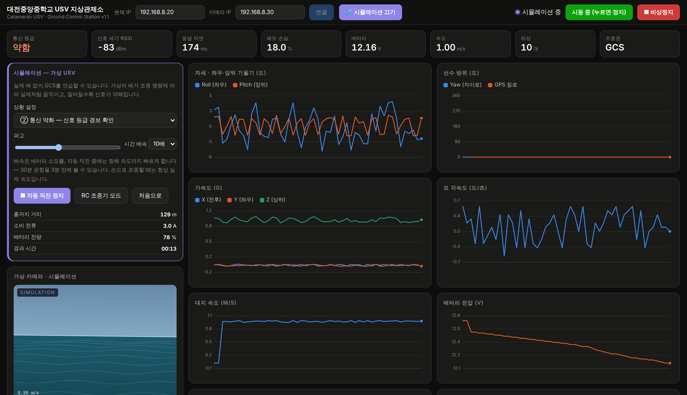

131 m 지점에서 **−84 dBm · 지연 174 ms · 손실 18 % · 등급 약함**.
이 상태라면 즉시 회항해야 합니다.

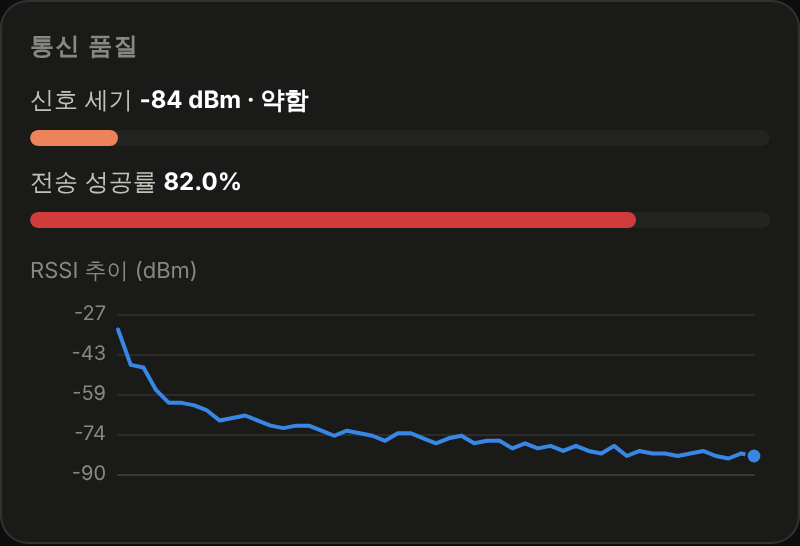

RSSI 추이 그래프가 오른쪽으로 갈수록 아래로 떨어지는 모습이 그대로 기록됩니다.
이 그래프를 캡처해 두면 "왜 안테나를 높이 올려야 하는가"를 설명할 자료가 됩니다.

---

### ③ 저전압 출발 — 배터리가 바닥나면

배터리 잔량 22 %에서 시작합니다. `시간 배속` 을 40배로 올리면 1분 안에 바닥이 납니다.

**확인할 것**

- 전압 그래프가 처음에는 완만하다가 끝에서 급격히 꺾입니다
- `10.8 V` 에서 배터리 타일이 노란색으로 바뀝니다
- `10.2 V` 에서 **시동이 저절로 풀리고** 로그에 경고가 뜹니다

이것이 실제 배에서 "돌아올 몫의 배터리를 남겨 두고 회항해야" 하는 이유입니다.
10.2 V에서 멈춘 배는 물 한가운데에 그대로 서 있게 됩니다.

---

### ④ 파고 높음 — 자세 센서는 무엇을 보는가

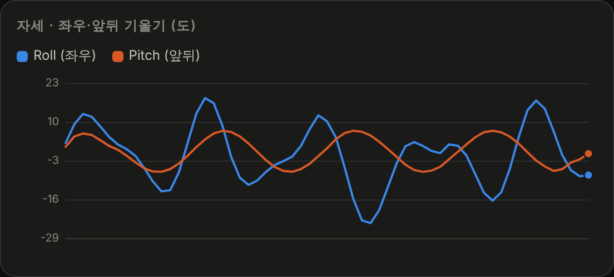

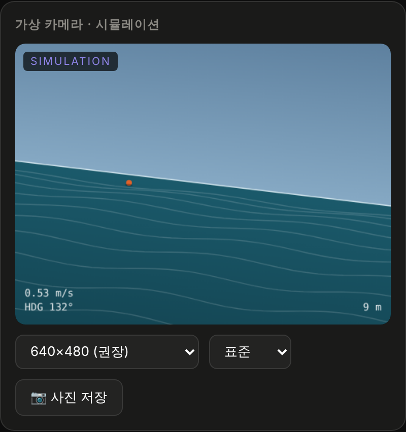

파도의 주기 성분이 롤·피치 그래프에 뚜렷하게 나타나고, 가상 카메라의 수평선이 크게 기울어집니다.
여기에 선회 시 횡경사가 겹치면 그래프가 꽤 복잡해집니다.

**수업 연결** — 이 흔들림 때문에 펌웨어에 **상보 필터(자이로 98 % + 가속도계 2 %)** 와
**21 Hz 저역통과 필터**가 들어갑니다. 센서값을 그대로 쓰면 왜 안 되는지 보여주기 좋은 장면입니다.

---

### ⑤ 전복 — 페일세이프는 정말 동작하는가

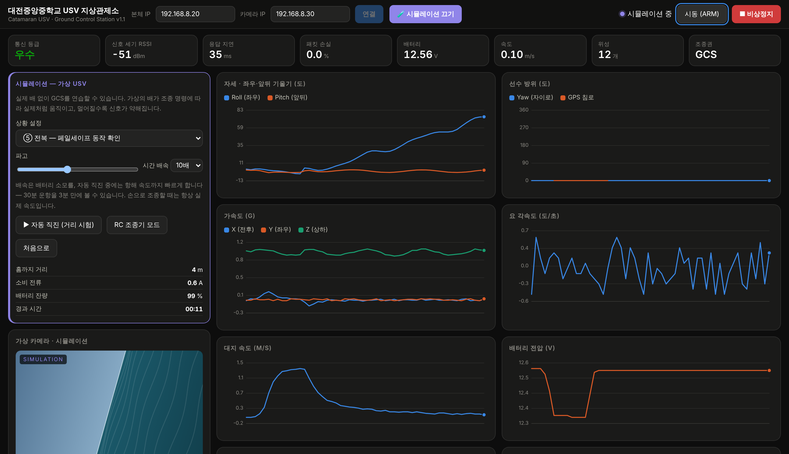

12초 뒤부터 배가 초당 9°씩 기울기 시작합니다.

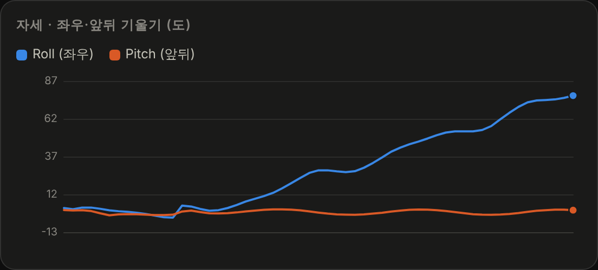

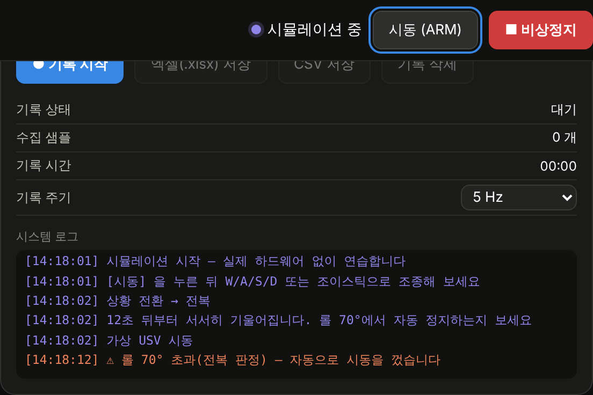

**롤 70°를 넘는 순간** 펌웨어와 같은 판정으로 시동이 꺼집니다. 로그를 보면
`⚠ 롤 70° 초과(전복 판정) — 자동으로 시동을 껐습니다` 가 찍히고, 오른쪽 위 버튼이
`시동 중` 에서 `시동 (ARM)` 으로 되돌아간 것을 볼 수 있습니다.

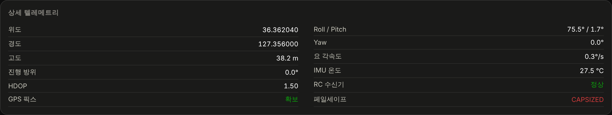

페일세이프 사유는 **5초간 화면에 붙잡아 둡니다.** 그러지 않으면 시동이 꺼지는 순간
모터 전류가 사라지면서 조건이 풀려 사유가 즉시 사라지고, 멀리서 조종하던 학생은
"왜 멈췄는지" 알 수 없게 됩니다.

---

### ⑥ 통신 두절 — 끊긴 걸 어떻게 아는가

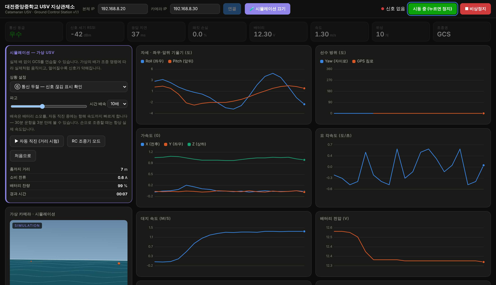

텔레메트리 송신과 명령 수신이 **완전히 멈춥니다.**

2초가 지나면 연결 표시가 `신호 없음` 으로 바뀌고 상태 타일 전체가 흐려집니다.

**왜 중요한가** — 이 감시견이 없으면 화면에는 마지막으로 받은 값이 그대로 남아 있습니다.
속도 1.3 m/s, 배터리 12.1 V, 통신 등급 양호 — 전부 멀쩡해 보이지만 **배는 이미 연락이 끊긴 상태**입니다.
학생이 이 차이를 눈으로 구분할 수 있어야 합니다.

---

### 상황 요약

| 번호 | 상황 | 무엇을 확인하나 | 관련 안전 규칙 |
|---|---|---|---|
| ① | 정상 운항 | 조종 감각, 차동추진 원리 | 출력 제한 40 %에서 시작 |
| ② | 통신 약화 | 등급 경보, 운용 한계 거리 | "주의"에서 더 가지 않기 |
| ③ | 저전압 출발 | 전압 강하, 10.2 V 자동 정지 | 돌아올 배터리 남기기 |
| ④ | 파고 높음 | 자세 그래프 읽기 | 거친 날 운항 금지 |
| ⑤ | 전복 | 롤 70° 페일세이프 | 회수 계획 세우기 |
| ⑥ | 통신 두절 | 신호 끊김 감지 | 로프·보트 준비 |

---

## 7. 가상 카메라

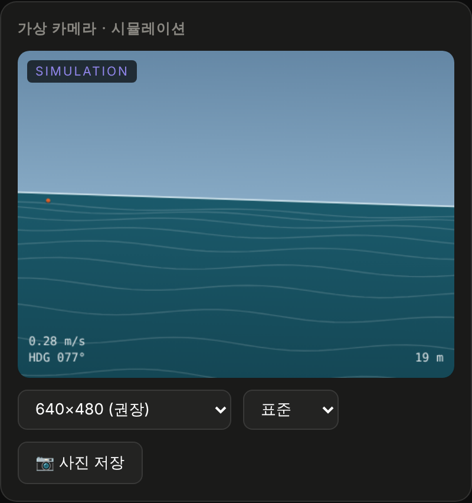

실제 운용에서 MJPEG 영상이 들어올 자리에, 시뮬레이션에서는 캔버스로 그린 화면이 들어옵니다.

- **수평선** — 롤에 따라 기울고 피치에 따라 오르내립니다
- **파도** — 배의 속도에 맞춰 아래로 흘러갑니다
- **부표 6개** — 고정된 세계 좌표에 놓여 있고, 배의 위치·방위에 따라 원근 투영됩니다
- **HUD** — 속도 · 선수 방위 · 홈까지 거리

부표가 핵심입니다. 수평선과 파도만 있으면 배가 움직이는지 알 수 없지만,
부표가 옆으로 흘러가면 **지금 돌고 있다**는 것을 눈으로 알 수 있습니다.

---

## 8. 수업에 쓰기

부품을 기다리는 동안 4차시를 채울 수 있습니다.

### 1차시 — 조종과 추진 원리 (상황 ①)

1. 시뮬레이션을 켜고 시동, 출력 제한 40 %로 자유 조종 10분
2. 제자리 회전을 시키며 **좌·우 ESC 펄스 값**을 관찰
3. 발문 — *"왜 한쪽은 1500보다 크고 다른 쪽은 작은가?"*
4. 출력 제한을 100 %로 올려 보고, 왜 40 %에서 시작하라고 했는지 체감

### 2차시 — 통신과 운용 한계 (상황 ②)

1. `자동 직진` 을 켜고 RSSI 추이 그래프를 함께 관찰
2. 등급이 `우수 → 양호 → 주의 → 약함` 으로 바뀌는 거리를 각자 기록
3. 발문 — *"우리 팀의 운용 한계 거리는 몇 m로 정하겠는가? 왜?"*
4. [03-NETWORK.md](03-NETWORK.md) 와 연결 — 안테나를 높이면 이 거리가 어떻게 달라지는가

### 3차시 — 데이터 읽기와 분석 (상황 ④)

1. `기록 시작` → 3분간 다양하게 조종 → `엑셀(.xlsx) 저장`
2. 엑셀에서 속도-전류 산점도, 시간-전압 꺾은선 그리기
3. 발문 — *"스로틀을 2배로 올리면 전류는 몇 배가 되는가?"* (답: 세제곱이므로 8배)
4. 요약 시트의 최소·최대·평균이 어떻게 계산된 것인지 확인

### 4차시 — 안전과 페일세이프 (상황 ③⑤⑥)

1. 세 상황을 차례로 재현하며 화면 변화를 캡처
2. 각 상황에서 **실제 물 위라면 어떻게 대응할 것인지** 팀별로 절차 작성
3. 그 절차를 [02-BUILD.md](02-BUILD.md) 의 운항 전 점검표와 비교
4. 발문 — *"페일세이프가 모터를 세운 뒤, 배는 어떻게 되는가?"* (답: 물 위에 그대로 떠 있다 — 그래서 회수 계획이 필요하다)

> [!TIP]
> 각 차시마다 엑셀 파일을 저장해 두면, 나중에 실제 배로 운항한 데이터와 **같은 형식으로** 비교할 수 있습니다.
> 요약 시트의 `데이터 종류` 열이 시뮬레이션과 실측을 구분해 줍니다.

---

## 9. 시뮬레이션이 흉내 내지 못하는 것

> [!CAUTION]
> **시뮬레이션에서 얻은 숫자를 실제 성능의 근거로 쓰지 마세요.**
> 연습과 이해를 위한 도구이지, 설계 검증 도구가 아닙니다.

| 빠진 것 | 실제로는 |
|---|---|
| 바람·조류 | 가벼운 에어보트는 옆바람에 크게 밀립니다 |
| 수초·부유물·충돌 | 프로펠러가 수면 위에 있어도 선체는 걸립니다 |
| 조파저항·활주 전이 | 2차 항력 근사라서 실제 쌍동선의 속도 곡선과 다릅니다 |
| 수면 반사·프레넬 존 | 전파 모델이 자유공간 근사입니다. 실제 수면 위 전파는 훨씬 복잡합니다 |
| 지향성 안테나 조준 | 빔 폭을 벗어나면 신호가 급격히 떨어지는 효과가 없습니다 |
| GPS 오차·멀티패스 | 위치가 실제보다 깨끗합니다 |
| 영상 압축·버퍼 지연 | 실제 MJPEG는 0.3~1초 늦게 도착합니다 |
| 모터 발열·배터리 온도 | 장시간 운항 시 성능 저하가 없습니다 |

실제 성능은 [02-BUILD.md 의 5단계 시험 절차](02-BUILD.md)로 직접 측정하고,
그 값을 `hardware/대전중앙중_USV_BOM.xlsx` 의 `추진성능계산` 시트에 넣어 갱신하세요.

---

## 코드 위치

시뮬레이터는 `gcs/index.html` 안의 **9장 — 시뮬레이터** 절에 모여 있습니다.

| 구성 요소 | 설명 |
|---|---|
| `class UsvSim` | 물리·통신·전력 모델 전체 |
| `UsvSim.step()` | 50 Hz 상태 적분 + 페일세이프 판정 |
| `UsvSim.packet()` | 펌웨어와 동일한 형식의 텔레메트리 생성 |
| `UsvSim.command()` | GCS 명령 수신 (`drive` / `arm` / `stop` / `ping`) |
| `simLoop()` | 구동 루프 · 손실률만큼 패킷 폐기 |
| `drawSimCam()` | 가상 카메라 렌더링 |

`send()` 함수 하나가 실제 WebSocket과 시뮬레이터 중 어디로 보낼지 결정합니다.
그 아래 모든 화면 코드는 **둘을 구분하지 않습니다** — 그래서 시뮬레이션으로 검증한 것이
실제 운용에서도 똑같이 동작합니다.

---

[→ 다음: 06-TROUBLESHOOTING.md (고장 진단)](06-TROUBLESHOOTING.md)
